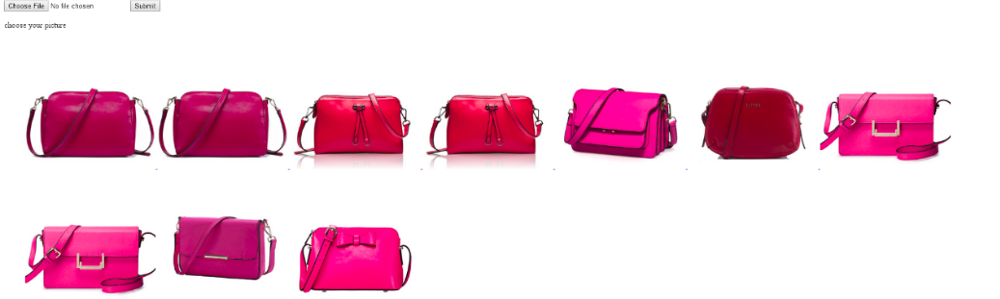
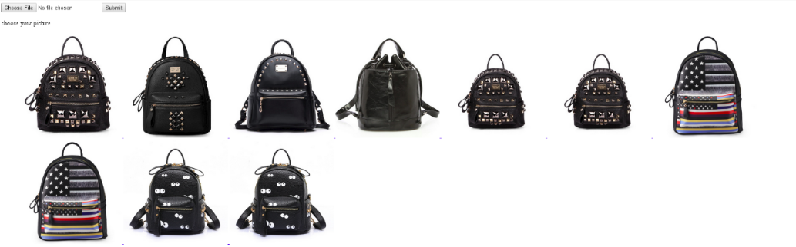
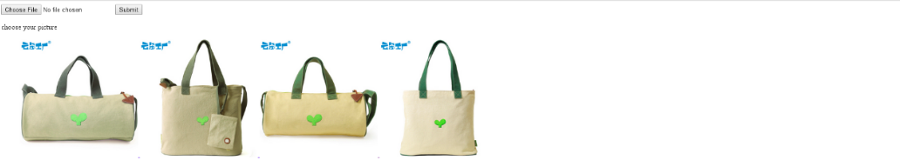

# DeepLearing

**Search Images by Image**, a project about Deep Learing application

**Based on E-commerce Sites's Goods Search**

* Phase 1 : Data collection by web crawler clear -- July 10th, 2015
* Phase 2 : Feature extraction by caffe clear -- July 16th, 2015
* Phase 3 : Feature transformation into hash code clear -- July 21th, 2015
* Phase 4 : Multi-Index Hashing clear -- July 24th, 2015
* Phase 5 : Multi-label caffe model training clear -- July 31st, 2015
* Phase 6 : Modules connected by socket clear -- Aug 4th, 2015
* Phase 7 : Optimization(Fast-RCNN, MIH, Weight-based piecewise caffe model training according to different label info concerned) -- Aug 13th, 2015
* Project Completed -- Aug 14th, 2015

## Result Screenshot

## About

* [Github Repository](https://github.com/JackieTseng/DeepLearning-Application)
* Author : Zhuobin Zheng(Jackie Tseng)
* Aug. 2015

