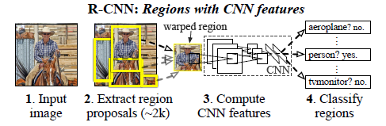

#R-CNN Paper Notes (Regions with CNN features)
##Problems Focus
* Localizing objects with a deep network
* Training a high-capacity model with only a small quantity of annotated detection data

##Procedure overview
* Takes an input image
* Extracts around **2000** bottom-up region proposals
* Computes features for each proposal using a large convolutional neural network (***CNN***)
* Classifies each region using class-specific linear ***SVMs*** and score

##Model Design
* Region proposals : use [***selective search***](http://koen.me/research/pub/uijlings-ijcv2013-draft.pdf) to generate around **2000** category-independent region proposals and compute a fix-size CNN input by ***affine image warping***
* Feature extraction : extract a **4096**-dimensional feature vector from each region proposal computed by forward propagating a mean-subtracted **227 x 227** RGB image through five convolutional layers and two fully connected layers using the ***Caffe***

##Test-time detection
* Classify : For each class, we score each extracted feature vector using the SVM trained for that class. Given all scored regions in an image. Apply a ***greedy non-maximum suppression*** (for each class independently) that rejects a region if it has an intersection-over-union (**IoU**) overlap with a higher scoring selected region larger than a learned threshold.
* Run-time analysis : (Two properties make efficient)
    + First, all CNN parameters are shared across all categories
    + Second, the feature vectors computed by the CNN are low-dimensional

##Training
* Supervised pre-training
* Domain-specific fine-tuning
* Object category classifiers

##Reference
[Rich feature hierarchies for accurate object detection and semantic segmentation](http://www.cs.berkeley.edu/~rbg/papers/r-cnn-cvpr.pdf)
